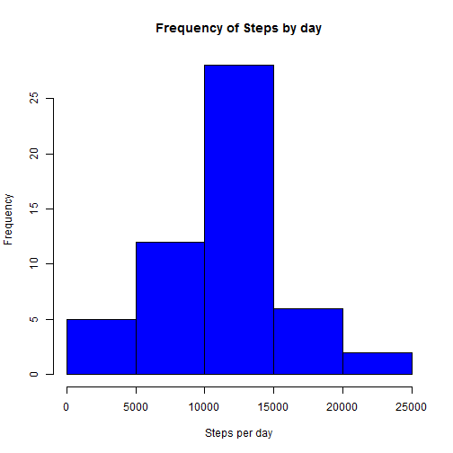
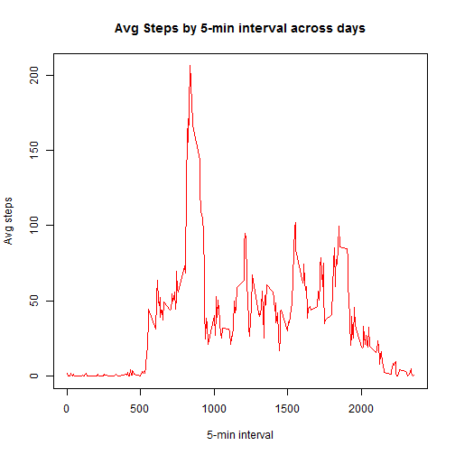
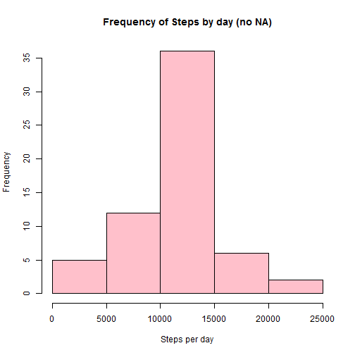
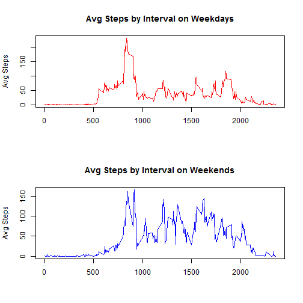

---
title: "Course5Week2_Assignment_JLo"
author: "Joyce Lo"
date: "November 5, 2017"
output: html_document
---

This is my R markdown file for Course 5 Reproducible Research, Week 2 assignment

Chunk 1: This first code chunk sets global parameters.  We always want to show the codes and results


```r
library(knitr)
opts_chunk$set(echo=TRUE)
```

Chunk 2: The 2nd code chunk reads the data from the URL


```r
fileURL <- "https://d396qusza40orc.cloudfront.net/repdata%2Fdata%2Factivity.zip"
if(!file.exists("data")){dir.create("data")}
download.file(fileURL, destfile="./data/ActivityMonitoringData.zip")
unzip(zipfile = "./data/ActivityMonitoringData.zip", exdir = "./data")

steps_data <- read.csv("./data/activity.csv")

#let's remove the missing entries and format dates
new_steps_data <- na.omit(steps_data)
new_steps_data$date <- as.Date(new_steps_data$date)
```

Chunk 3a: This code chunk sums the number of steps by day 


```r
library(dplyr)

Total_steps_byDay <- new_steps_data %>%
  group_by(date) %>%
  summarize(Total_steps=sum(steps))

print(Total_steps_byDay)
```

Chunk 3b: This code chunk generates a histogram of total steps by day


```r
hist(Total_steps_byDay$Total_steps, col="blue", xlab="Steps per day", ylab="Frequency", main="Frequency of Steps by day")
```



Chunk 3c: this code chunk reports the mean and median Total_steps_by_day

```r
mean(Total_steps_byDay$Total_steps)
```

```
## [1] 10766.19
```

```r
median(Total_steps_byDay$Total_steps)
```

```
## [1] 10765
```

Chunk 4a: this code chunk averages the steps by 5-min interval instead of totaling it by day

```r
avg_step_byint <- new_steps_data %>%
  group_by(interval) %>%
  summarize(Avg_steps_by5min=mean(steps))

print(avg_step_byint)
```

Chunk 4b: this code chunk plots a line graph of the average steps by the 5-min intervals

```r
plot(avg_step_byint$interval, avg_step_byint$Avg_steps_by5min, type="l", col="red", xlab = "5-min interval", ylab = "Avg steps", main = "Avg Steps by 5-min interval across days")
```



Chunk 4c: this code chunk looks for the 5-min interval with the most steps on average across days

```r
avg_step_byint[which.max(avg_step_byint$Avg_steps_by5min),]
```

Chunk 5a: this code chunk counts # of total missing values in dataset

```r
sum(is.na(steps_data))
```

```
## [1] 2304
```

Chunk 5b: this code chunk replaces missing values with the avg # of steps from other observations with the same 5-min interval

```r
no_NA_data <- steps_data %>%
  group_by(interval) %>%
  mutate(steps= ifelse(is.na(steps), mean(steps,na.rm=TRUE), steps))
```

Chunk 5c: This code chunk sums the number of steps by day using new data set


```r
NoNA_Total_steps_byDay <- no_NA_data %>%
  group_by(date) %>%
  summarize(noNA_Total_steps=sum(steps))

print(NoNA_Total_steps_byDay)

#something is off with Oct-02-2012. Perhaps the test subject wasn't wearing his device
```

Chunk 5d: This code chunk generates a histogram of total steps by day (no NA)


```r
hist(NoNA_Total_steps_byDay$noNA_Total_steps, col="pink", xlab="Steps per day", ylab="Frequency", main="Frequency of Steps by day (no NA)")
```



Chunk 5e: this code chunk reports the mean and median Total_steps_by_day (no NA)

```r
mean(NoNA_Total_steps_byDay$noNA_Total_steps)
```

```
## [1] 10766.19
```

```r
median(NoNA_Total_steps_byDay$noNA_Total_steps)
```

```
## [1] 10766.19
```

Chunk 6a: this code chunk creates a new variable that classifies dates as either weekend or weekday

```r
no_NA_data$date <- as.Date(no_NA_data$date)

no_NA_data$weekend_weekday <- ifelse(weekdays(no_NA_data$date) %in% c("Saturday", "Sunday"), "weekend", "weekday")
```

Chunk 6b: this code chunk averages the steps by 5-min interval  for weekends and weekdays

```r
Interval_weekends <- subset(no_NA_data, weekend_weekday=='weekend')%>%
  group_by(interval) %>%
  summarize(Avg_steps_by5min=mean(steps))

head(Interval_weekends,10)

Interval_weekdays <- subset(no_NA_data, weekend_weekday=='weekday')%>%
  group_by(interval) %>%
  summarize(Avg_steps_by5min=mean(steps))

head(Interval_weekdays,10)
```

Chunk 6c: this code chunk produces a multi-faceted line graph contrasting the avg steps by interval on weekdays vs. weekends using base-plotting


```r
par(mfrow=c(2,1))#we want two rows, one column
plot(Interval_weekdays$interval, Interval_weekdays$Avg_steps_by5min, type="l", ylab="Avg Steps", xlab="", main="Avg Steps by Interval on Weekdays", col="red")
plot(Interval_weekends$interval, Interval_weekends$Avg_steps_by5min, type="l", ylab="Avg Steps", xlab="", main="Avg Steps by Interval on Weekends", col="blue")
```




```r
library(knitr)
library(markdown)
knit2html("JLo_Week2Assignment_RMarkdown.rmd")
```

```
## Warning in readLines(con): cannot open file
## 'JLo_Week2Assignment_RMarkdown.rmd': No such file or directory
```

```
## Error in readLines(con): cannot open the connection
```

```r
browseURL("JLo_Week2Assignment_html.html")
```
*This concludes my R Markdown file for this assignment*


